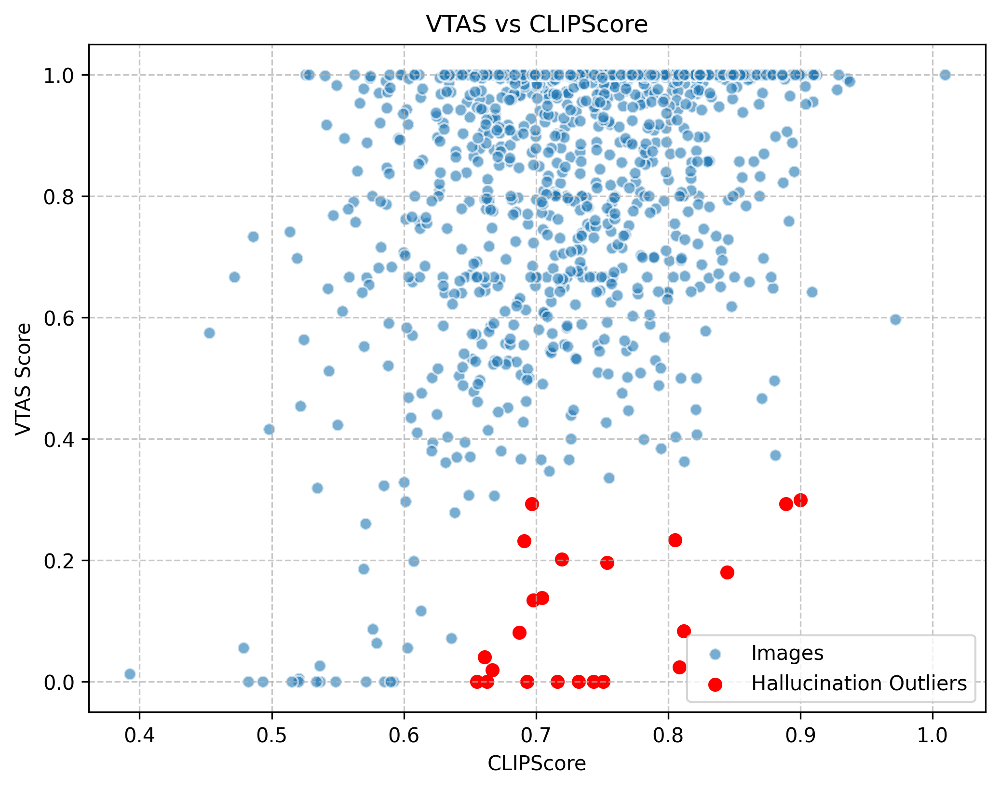
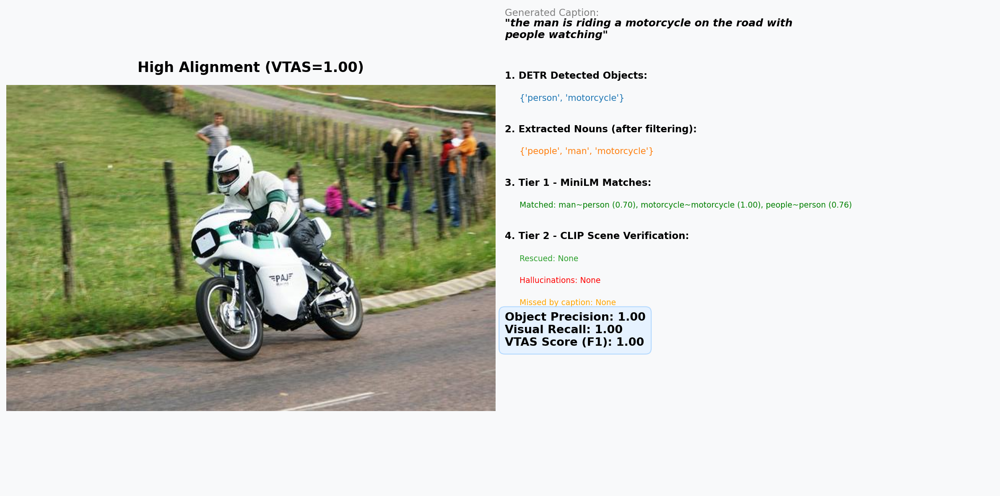
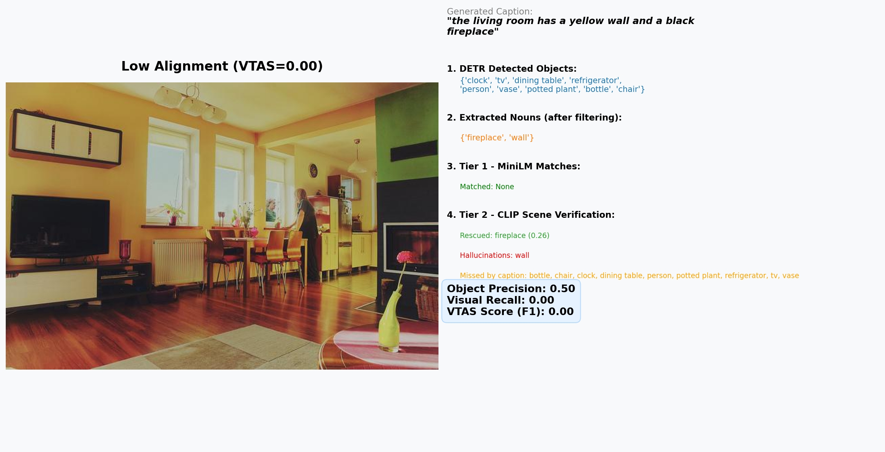

# VTAS — Visual-Truth Alignment Score

[](https://badge.fury.io/py/vtas-metric)
[](LICENSE)
[](https://www.python.org/)

**A white-box, reference-free evaluation metric for image captioning that grounds generated text directly against the visual content of the image.**

> *"Does the model see what it says it sees?"* — VTAS answers this question without needing human reference captions.

---

## Installation 🚀

VTAS is now officially available on PyPI! You can install it instantly via pip:

```bash
pip install vtas-metric
```

**Quickstart Usage:**
```python
from vtas import VTASEvaluator

evaluator = VTASEvaluator()

result = evaluator.score(
    image_path="path/to/image.jpg",
    caption="A man throws a frisbee to his dog in the park"
)

print(f"VTAS Score (F1): {result['vtas_score']:.4f}")
print(f"Object Precision: {result['precision']:.4f}")
print(f"Visual Recall: {result['recall']:.4f}")
print(f"Matched Objects: {result['matched']}")
print(f"Hallucinated Objects: {result['hallucinated']}")
```

### Advanced Configuration (Hyperparameters)
You can heavily customize how strict VTAS is by tuning its hyperparameters during initialization:

```python
evaluator = VTASEvaluator(
    detection_confidence=0.7,  # How confident DETR must be to register a visual object
    similarity_threshold=0.60, # The MiniLM Cosine distance required to match text to boxes
    clip_threshold=0.15,       # The CLIP Cosine distance required to 'rescue' a mass noun
    beta=1.0                   # F-beta weighting (beta < 1 prioritizes Precision/Hallucinations)
)
```

---

## Why Does This Metric Exist?

Image captioning models generate natural language descriptions of images. To measure how "good" a generated caption is, the research community relies on a set of standard metrics. However, every single one of them shares a critical architectural flaw: **they are blind to the image.**

They compare the **generated text** against **human-written reference text**, but never verify whether the generated text actually describes what is physically present in the image. This creates three categories of failure:

### The CLIPScore Hallucination Problem
Modern reference-free metrics like **CLIPScore** act as a visual "bag of words." If a model hallucinates an object, CLIPScore simply averages it out and ignores the error, giving falsely high scores to terrible captions. 

As shown in our 1,000-image COCO validation study below, VTAS actively punishes the "Hallucination Outliers" (Red Dots) that CLIPScore blindly approves:



### The Problem with Legacy Metrics

#### 1. BLEU (Bilingual Evaluation Understudy)
BLEU measures n-gram precision — it counts how many word chunks in the generated caption appear in the human reference.

**The Flaw:** It is purely lexical. It has no understanding of meaning.

| Generated Caption | Reference Caption | BLEU-4 Score | Correct? |
|---|---|---|---|
| *"A man relaxes on a sofa"* | *"A person sits on a couch"* | **~0.0** (no 4-gram overlap) | ✅ Yes — semantically identical |
| *"A person sits on a couch near a dog"* | *"A person sits on a couch"* | **High** (strong overlap) | ❌ Maybe — was there actually a dog? BLEU doesn't check. |

> BLEU punishes correct captions that use synonyms, and rewards captions that copy reference words — even if the referenced objects are hallucinated.

#### 2. METEOR (Metric for Evaluation of Translation with Explicit ORdering)
METEOR improves on BLEU by adding stemming ("running" → "run") and synonym matching via external WordNet tables.

**The Flaw:** It still compares text-to-text. It relies on pre-built synonym tables that are finite, language-specific, and cannot cover domain-specific vocabulary. It never verifies against the image.

#### 3. CIDEr (Consensus-based Image Description Evaluation)
CIDEr uses TF-IDF weighting to reward captions that mention rare, image-specific words (e.g., "frisbee" scores higher than "the").

**The Flaw:** It is entirely dependent on the consensus of human reference captions. If the reference captions are biased, incomplete, or inconsistent, CIDEr scores become unreliable. It cannot detect hallucinations if the hallucinated word happens to appear in a reference.

#### 4. CLIPScore
CLIPScore is the current state-of-the-art reference-free metric. It embeds both the image and the text into a shared vector space using CLIP and computes cosine similarity.

**The Flaw:** It is a **black box**. It outputs a single similarity score but provides zero interpretability. If the score is low, there is no way to determine whether the model missed an object, hallucinated one, got a color wrong, or made a spatial error.

#### 5. CHAIR (Caption Hallucination Assessment with Image Relevance)
CHAIR was specifically designed to detect object hallucinations by comparing generated nouns against ground-truth object annotations.

**The Flaw:** It requires **expensive, human-annotated object labels** for every image. It cannot run on raw, unannotated images, making it impractical for real-world deployment at scale.

---

### The Gap

| Capability | BLEU | METEOR | CIDEr | CLIPScore | CHAIR |
|---|:---:|:---:|:---:|:---:|:---:|
| Reference-Free | ❌ | ❌ | ❌ | ✅ | ❌ |
| Detects Hallucinations | ❌ | ❌ | ❌ | Weak | ✅ |
| Handles Synonyms | ❌ | Partial | ❌ | ✅ | ❌ |
| White-Box / Interpretable | ✅ | ✅ | ✅ | ❌ | ✅ |
| Fully Automated (No Human Labels) | ✅ | ✅ | ✅ | ✅ | ❌ |

**No single existing metric is simultaneously: reference-free, hallucination-aware, synonym-robust, interpretable, AND fully automated.**

VTAS is engineered to fill that gap.

---

## What is VTAS?

VTAS (Visual-Truth Alignment Score) is a **Two-Tier Compound AI System** that evaluates image captions against physical reality:

1. **Tier 1 (Object Grounding):** An Object Detector (DETR) extracts physical objects. An NLP Parser (spaCy) extracts caption nouns. A Semantic Bridge (MiniLM, phrase-based) resolves synonyms.
2. **Tier 2 (Scene/Context Grounding):** Unmatched nouns (e.g., "bedroom", "outside", or undetected objects) are verified globally against the image using CLIP zero-shot classification.

The final **VTAS Score (v1.2)** uses the mathematically rigorous **F-beta Score** to balance **Object Precision** (absence of hallucinations) and **Visual Recall** (detecting visible objects) into a single metric [0, 1].

### VTAS Properties
| Property | Value |
|---|---|
| Reference-Free | ✅ No human captions needed |
| Detects Hallucinations | ✅ Explicit precision penalty for invented objects |
| Handles Synonyms | ✅ Phrase-based semantic embeddings |
| Scene Aware | ✅ Tier 2 CLIP validates complex environments |
| Interpretable | ✅ Pinpoints exactly which word failed |

---

## Pictorial Demonstrations (VTAS in Action)

The following infographics were generated automatically during a VTAS evaluation run. They visually demonstrate how VTAS solves the flaws of legacy metrics.

### Example 1: Perfect Alignment & Synonym Bridging
Unlike BLEU, VTAS physically draws bounding boxes to verify reality. Even if the wording differs from human annotators, VTAS bridges the vocabulary gap using phrase-based semantic matching.


### Example 2: Scene Context & The "Recall Penalty"
Traditional metrics like CHAIR crash without human bounding boxes. VTAS operates autonomously.
* **Tier 2 Rescue:** Notice how words like "fireplace" (which DETR missed) are rescued by the CLIP context module!
* **Visual Recall Penalty:** This caption scored an F1 of 0.00 not because it hallucinated wildly, but because it *described the scene* instead of listing the physical objects detected by DETR. 


---

## Quick Start

```python
from vtas import VTASEvaluator

evaluator = VTASEvaluator()

result = evaluator.score(
    image_path="path/to/image.jpg",
    caption="A man throws a frisbee to his dog in the park"
)

print(f"VTAS Score (F1): {result['vtas_score']:.4f}")
print(f"Object Precision: {result['precision']:.4f}")
print(f"Visual Recall: {result['recall']:.4f}")
print(f"Matched Objects: {result['matched']}")
print(f"Hallucinated Objects: {result['hallucinated']}")
```

---

## Examples

### Example 1: Perfect Caption
**Image:** A park scene with a person, a dog, and a frisbee.

| Component | Output |
|---|---|
| **DETR detects** | `{'person', 'dog', 'frisbee'}` |
| **Caption says** | *"A man throws a frisbee to his dog"* → `{'man', 'frisbee', 'dog'}` |
| **Semantic Bridge** | man↔person (0.82 ✅), frisbee↔frisbee (1.0 ✅), dog↔dog (1.0 ✅) |
| **Visual Recall** | 3/3 = 1.0 |
| **Hallucination Rate** | 0/3 = 0.0 |
| **VTAS** | **1.0** ✅ |

### Example 2: Synonym Robustness (BLEU would fail here)
**Image:** A living room with a person, a couch, and a TV.

| Component | Output |
|---|---|
| **DETR detects** | `{'person', 'couch', 'tv'}` |
| **Caption says** | *"A man relaxes on a sofa watching television"* → `{'man', 'sofa', 'television'}` |
| **Semantic Bridge** | man↔person (0.82 ✅), sofa↔couch (0.89 ✅), television↔tv (0.91 ✅) |
| **Visual Recall** | 3/3 = 1.0 |
| **Hallucination Rate** | 0/3 = 0.0 |
| **VTAS** | **1.0** ✅ |

> BLEU-4 would score this near zero because no exact 4-grams match. VTAS correctly identifies it as a perfect caption.

### Example 3: Hallucination Detection
**Image:** A boy holding an umbrella standing near a cow.

| Component | Output |
|---|---|
| **DETR detects** | `{'person', 'umbrella', 'cow'}` |
| **Caption says** | *"A group of people with umbrellas and dogs"* → `{'group', 'people', 'umbrellas', 'dogs'}` |
| **Semantic Bridge** | people↔person (0.85 ✅), umbrellas↔umbrella (0.97 ✅), group↔? (❌), dogs↔cow (0.45 ❌) |
| **Visual Recall** | 2/3 = 0.67 (missed 'cow') |
| **Hallucination Rate** | 2/4 = 0.50 (hallucinated 'group', 'dogs') |
| **VTAS** | **0.33** ❌ — Correctly penalized |

> This is a real hallucination observed during our BLIP zero-shot baseline evaluation. Traditional metrics may still score this reasonably if the reference caption mentions "people." VTAS catches it because DETR confirms there is no "group" or "dogs" in the image.

---

## Installation

```bash
pip install -r requirements.txt
```

### Dependencies
- `torch` — PyTorch backend
- `transformers` — Hugging Face (DETR object detection)
- `sentence-transformers` — MiniLM semantic embeddings
- `spacy` — NLP noun extraction
- `Pillow` — Image processing

---

## Project Structure
```
VTAS_Evaluation_Metric/
├── src/
│   ├── vtas.py                  # Core VTAS evaluator class
│   ├── visual_grounding.py      # DETR-based object detection module
│   ├── linguistic_extraction.py # spaCy-based noun extraction module
│   └── semantic_bridge.py       # MiniLM-based semantic similarity module
├── docs/
│   └── architecture.md          # Full architectural specification & math
├── requirements.txt
├── .gitignore
└── README.md
```

---

## Known Limitations & Future Work

VTAS v1 is a strong first step, but we believe in transparent research. The following are **known architectural limitations** that we have identified through extensive evaluation and are actively working to resolve.

### Limitation 1: Semantic Collapse in the Semantic Bridge

**Observed in:** Motorcycle example (Image #78, VTAS = 1.00)


**The Problem:** The caption reads *"the man is riding a motorcycle on the road with people watching."* DETR detected only `{'person', 'motorcycle'}`. The Semantic Bridge matched both `"man" → person (0.70)` and `"people" → person (0.76)`. On the surface, this appears correct — VTAS gave a perfect 1.00. But look closely:

* `"man"` refers to the **rider** (the main subject).
* `"people"` refers to the **spectators** in the background (secondary subjects).

These are two semantically distinct groups, but both collapsed onto the **single DETR label `"person"`**. VTAS treated them as the same entity. This is a fundamental limitation:

> **VTAS v1 operates on unordered sets of labels.** It has no concept of *which* person is being referenced. If DETR detects one `"person"`, any number of human-related nouns ("man", "woman", "people", "boy") in the caption will all match it, even if they refer to different individuals. This inflates both Precision and Recall.

**Root Cause:** DETR returns *unique category labels*, not instance-level detections. Even if DETR internally draws 5 bounding boxes for 5 people, the VTAS pipeline reduces them to the single label `"person"`.

### Limitation 2: Scene-Level Descriptions Penalized by Object-Level Recall

**Observed in:** Living room example (Image #0, VTAS = 0.00)


**The Problem:** The caption reads *"the living room has a yellow wall and a black fireplace."* DETR detected 9 objects: `{'clock', 'tv', 'dining table', 'refrigerator', 'person', 'vase', 'potted plant', 'bottle', 'chair'}`. The caption mentioned none of these individual items — it described the **collective environment** instead. As a result:

* **Object Precision = 0.50** — `"fireplace"` was rescued by CLIP (Tier 2), but `"wall"` was marked as a hallucination.
* **Visual Recall = 0.00** — The caption mentioned 0 out of 9 detected objects.
* **VTAS (F1) = 0.00** — Because F1 is a harmonic mean, if either P or R is 0, the entire score collapses.

This is arguably the **most important limitation**: a VLM that writes *"the kitchen is clean and ready for us to use"* receives a VTAS of 0.00, even though that caption is a perfectly valid, human-like description of a kitchen. The model correctly identified the scene but chose to describe it holistically rather than itemizing the oven, refrigerator, sink, cups, and bowls that DETR found.

> **VTAS v1 is an object-listing metric, not a scene-understanding metric.** It heavily rewards captions that enumerate discrete objects ("there is a clock, a TV, a chair, and a bottle") and penalizes captions that describe the scene as a whole ("this is a clean, well-lit living room"). This is by design — VTAS measures *grounded object alignment* — but it means that VTAS alone cannot evaluate the full quality of a caption.

**Root Cause:** The F-beta score requires non-zero Recall. When a caption contains zero object-level nouns that overlap with DETR's detections, Recall = 0, and the harmonic mean forces the entire score to 0 regardless of Precision.

---

### Future Work

Based on the limitations above, we propose the following research directions for VTAS v2:

| Direction | Addresses | Approach |
|---|---|---|
| **Instance-Aware Grounding** | Limitation 1 | Replace set-based matching with instance-level alignment. Use DETR's bounding box coordinates to distinguish "the rider" from "the spectators". Match each caption noun to a specific detection, preventing multiple nouns from collapsing onto one label. |
| **Scene-Level Recall** | Limitation 2 | Introduce a secondary recall signal that rewards captions for correctly identifying the *type* of scene (kitchen, bedroom, park) using CLIP or a dedicated scene classifier (e.g., Places365). A caption like "the kitchen is clean" would earn partial Recall credit for correctly classifying the environment. |
| **Attribute-Level Grounding** | New capability | Extend VTAS beyond nouns to verify adjectives ("red car", "large dog"). Use visual question-answering or attribute classifiers to check if described properties (color, size, material) match the image. |
| **Spatial Awareness** | New capability | Verify spatial claims ("the dog is *next to* the person", "the cup is *on* the table") against the physical coordinates of DETR bounding boxes. |
| **Dynamic Threshold Calibration** | Both | Replace the fixed similarity thresholds (MiniLM τ=0.65, CLIP τ=0.22) with dataset-adaptive thresholds calibrated on a held-out validation split, similar to ROC-AUC optimal threshold selection. |

---


## Repository Structure 📂

This repository is organized into distinct modules to separate the core library from research experiments:

- **src/vtas/**: The core, PyPI-installable Python package containing the metric algorithms (Semantic Bridge, CLIP Fallback, Saliency Scoring).
- **experiments/**: The Kaggle runner scripts (
un_evaluation.py, 
un_baselines.py) used to generate the results and ablation studies for the paper.
- **examples/**: Simple tutorials (atch_test_vtas.py) showing how to use the metric on custom image folders.
- **tests/**: Unit tests for verifying metric math and extraction logic.

---

## License

This project is licensed under the [MIT License](LICENSE).

## Citation

If you use VTAS in your research, please cite:

```bibtex
@software{prasad2026vtas,
  author    = {Prasad, Ritanshu},
  title     = {VTAS: Visual-Truth Alignment Score},
  year      = {2026},
  url       = {https://github.com/Ritanshu-Prasad/VTAS_Evaluation_Metric},
  license   = {MIT}
}
```
